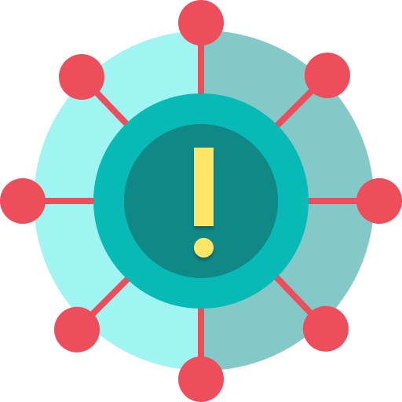

<!--
*** Thanks for checking out this README Template. If you have a suggestion that would
*** make this better, please fork the repo and create a pull request or simply open
*** an issue with the tag "enhancement".
*** Thanks again! Now go create something AMAZING! :D
-->


<!-- PROJECT SHIELDS -->
<!--
*** I'm using markdown "reference style" links for readability.
*** Reference links are enclosed in brackets [ ] instead of parentheses ( ).
*** See the bottom of this document for the declaration of the reference variables
*** for contributors-url, forks-url, etc. This is an optional, concise syntax you may use.
*** https://www.markdownguide.org/basic-syntax/#reference-style-links
-->
[![Contributors][contributors-shield]][contributors-url]
[![Forks][forks-shield]][forks-url]
[![Stargazers][stars-shield]][stars-url]
[![Issues][issues-shield]][issues-url]
[![MIT License][license-shield]][license-url]
[![LinkedIn][linkedin-shield]][linkedin-url]


<!-- PROJECT LOGO -->
<br />
<p align="center">
  <a href="https://raw.githubusercontent.com/hsuki/Covid19-tracker/master/src/img/logo2.png">
    
  </a>
  
  <h3 align="center">COVID-19 Tracker</h3>

  <p align="center">
    A basic webapp to display current Covid-19 stats in the United States
    <br />
    <a href="https://github.com/hsuki/Covid19-tracker/blob/master/README.md"><strong>Explore the docs »</strong></a>
    <br />
    <br />
    <a href="https://cvd19-tracker.netlify.app/">View Demo</a>
    ·
    <a href="https://github.com/hsuki/Covid19-tracker/issues">Report Bug</a>
    ·
    <a href="https://github.com/hsuki/Covid19-tracker/issues">Request Feature</a>
  </p>
</p>


<!-- TABLE OF CONTENTS -->
## Table of Contents

* [About the Project](#about-the-project)
  * [Built With](#built-with)
* [Getting Started](#getting-started)
  * [Prerequisites](#prerequisites)
  * [Installation](#installation)
* [Roadmap](#roadmap)
* [License](#license)
* [Contact](#contact)
* [Acknowledgements](#acknowledgements)


<!-- ABOUT THE PROJECT -->
## About The Project

![Covid-19 demo][product-screenshot]

I wanted to create my own version of a covid-19 tracker inspired by https://www.youtube.com/watch?v=khJlrj3Y6Ls

Here's why:
* To practice building frontend applications using ReactJS
* To build fundamental understanding of working with REST API's
* To practice content layout and displaying data to users

### Built With
* [ReactJS](https://reactjs.org/)


<!-- GETTING STARTED -->
## Getting Started

To get a local copy up and running follow these simple example steps:

### Prerequisites
* nvm
```sh
curl -o- https://raw.githubusercontent.com/nvm-sh/nvm/v0.35.3/install.sh | bash
```

* npm & nodejs
```sh
nvm install node
```

### Installation

1. Clone the repo
```sh
git clone https://github.com/hsuki/Covid19-tracker.git
```
3. Install NPM packages
```sh
npm install
```
4. Start local development server
```sh
npm start
```


<!-- ROADMAP -->
## Roadmap

See the [open issues](https://github.com/hsuki/Covid19-tracker/issues) for a list of proposed features (and known issues).


<!-- LICENSE -->
## License

Distributed under the MIT License. See `LICENSE` for more information.


<!-- CONTACT -->
## Contact

Jon Ham - jondwoo@gmail.com

Project Link: [https://github.com/hsuki/Covid19-tracker](https://github.com/hsuki/Covid19-tracker)


<!-- ACKNOWLEDGEMENTS -->
## Acknowledgements
* [axios](https://www.npmjs.com/package/axios)
* [Img Shields](https://shields.io)
* [Choose an Open Source License](https://choosealicense.com)
* [Material UI](https://material-ui.com/)
* [Chart.js](https://www.chartjs.org/)
* [react-chartjs-2](https://www.npmjs.com/package/react-chartjs-2)


<!-- MARKDOWN LINKS & IMAGES -->
<!-- https://www.markdownguide.org/basic-syntax/#reference-style-links -->
[contributors-shield]: https://img.shields.io/github/contributors/othneildrew/Best-README-Template.svg?style=flat-square
[contributors-url]: https://github.com/hsuki/Covid19-tracker/graphs/contributors
[forks-shield]: https://img.shields.io/github/forks/othneildrew/Best-README-Template.svg?style=flat-square
[forks-url]: https://github.com/hsuki/Covid19-tracker/network/members
[stars-shield]: https://img.shields.io/github/stars/othneildrew/Best-README-Template.svg?style=flat-square
[stars-url]: https://github.com/hsuki/Covid19-tracker/stargazers
[issues-shield]: https://img.shields.io/github/issues/othneildrew/Best-README-Template.svg?style=flat-square
[issues-url]: https://github.com/hsuki/Covid19-tracker/issues
[license-shield]: https://img.shields.io/github/license/othneildrew/Best-README-Template.svg?style=flat-square
[license-url]: https://github.com/hsuki/Covid19-tracker/blob/dev/LICENSE.txt
[linkedin-shield]: https://img.shields.io/badge/-LinkedIn-black.svg?style=flat-square&logo=linkedin&colorB=555
[linkedin-url]: https://www.linkedin.com/feed/?trk=homepage-basic_google-one-tap-submit
[product-screenshot]: src/img/covid-tracker-demo.png
